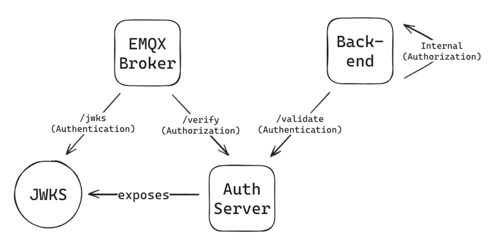
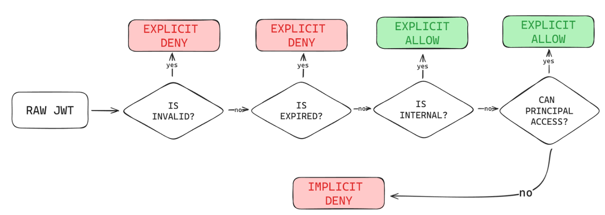

    

# Overview

“Auth” in this scenario stands for both authentication and authorization, two very important parts of the security process in any application. While they are often used interchangeably, that would be a misconception, since both of them have individual duties. Authentication focuses more on focusing on the validity of a principal’s claims, whilst authorization only verifies whether said principal has access to a specific resource.

It uses [Quarkus, the Supersonic Subatomic Java Framework](https://quarkus.io/) running Java 17, is written in Kotlin, and is deployed in Docker.

The job of this application is to issue & verify JWTs for all who want to access the Paddy API, be it HTTP or MQTT. It does not support HTTPS, as normally this runs inside a VPC.

## Auth Diagram

    

## Issuing

The JWT is the secure mechanism of choice for credential management. The first step in verifying whether a client is valid or not is by checking the signature of a JWT, which is performed for both Daemons and users. Looking at the schematic, it is clear that the EMQX broker is completely dependent on the service for its auth flow. Authentication for EMQX is done through a JSON Web Key Set (JWKS), a set of public keys used to verify whether the signature of a JWT is valid.

## Authorization Overview

Authorization is also an essential security component, since messages of a machine should only be accessed by principals that must have access (principle of least privilege applies here). To perform this, an intricate implicit-deny authorization pipeline was developed, which enables association of a given MQTT subscription topic with the relationship between a principal and a resource; more concretely the relationship between Daemons. There exist only two conditions where any given principal would be able to access a MQTT topic: If the given JWT is issued for internal use by the services, or if a principal has access to the underlying Daemon’s topic. The former is checked through the validity of a claim in the JWT’s payload, while the latter is easily checked by the Auth service through the extraction of the Daemon Serial Number from the topic a principal wishes to access. For instance, if the Daemon with an ID of `42` wishes to publish a turn-on message to the broker, it would be denoted by the topic string `daemon/42/v1/reads/toggle`. The `42` is extracted with a simple split on the `/` character, since all messages inside the broker have this format. Then, the Daemon has to prove they can publish that topic, which is checked statically by reading the `sub` claim from the JWT provided by the Daemon. Since the `sub` claim matches the Serial Number provided in the topic, this operation is allowed. However, if the Daemon was controlled by a malicious actor and wanted to publish to topic `daemon/43/v1/reads/toggle` instead, this operation would be denied, since the sub claim does not match the intended topic.

## Backend Authentication

Meanwhile, the Backend service only uses the Auth service for authentication, doing authorization completely internally. A similar process is followed, but with a key difference: instead of checking whether a Daemon can access the broker, it checks if a user can access the data of a specific Daemon, and all the information related to it. As such, all HTTP APIs exposed by the Backend service have been split into three parts: _Guest_, _Refresh_, and _User_. The first level does not require auth, and is publicly accessible; including sign-up and login APIs. The second one includes just the refresh API, representing a user that has a refresh token and wishes to retrieve a short-lived user token. User access is the full access to all APIs. However, all users are still subjected to principal checks, too, so they won’t be able to access other users’ data.

    

As such, even if the JWT of a physical device is extracted, a malicious actor will be unable to do anything more than sending messages to their own device. This approach is a secure, static, performant and database-less access control mechanism which prevents unwanted actors from reading other devices’ messages, or pretending they are those devices.

## Daemon JWT Rotation

Physical attack vectors are the most difficult ones to stop, since attackers have access to the device itself. Despite the previously mentioned methods, one should also make sure that inactive Daemons that may fall into the hands of a malicious party cannot be used to authenticate. As such, JWTs for Daemons also expire, and must be rotated periodically. This job is performed by the Auth component, too, by checking whether the current JWT may be near expiration, generating a new one for that specific Daemon and instructing it to store this new JWT. If the Daemon misses this rotational period, though, it has to be recovered manually.

## Verification

### HTTP Authentication

1. Signature is verified.
2. JWT Expiration is checked.

### HTTP Authorization

No Authorization for HTTP is done on this application. That is rather done on the Paddy Backend app.

### MQTT Authentication

A JWKS (JSON Web Key Set) is exposed in an API, and ingested by the MQTT Broker. This key is used to verify incoming usernames, which should be set to a valid JWT for anyone who wants to connect to the broker.

1. Signature is verified.
2. JWT Expiration is checked.

### MQTT Authorization

MQTT Authorization is performed by checking what action the client wants to perform. The scope of what a client can do is limited to the "sub" claim. For instance, if your sub claim was `17`, you can only connect to the broker if:

1. You have a valid JWT (see above).
2. You wish to publish/subscribe to a topic that begins with `daemon/17`. So, `daemon/17/hello` and `daemon/17/the/answer/is/42` are valid, but `daemonn/17` and `daemon/18/malicious/attack` are not. This is done to prevent eavesdropping on other daemons' messages or disrupting their flow.